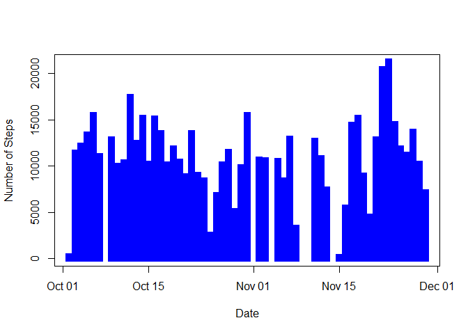
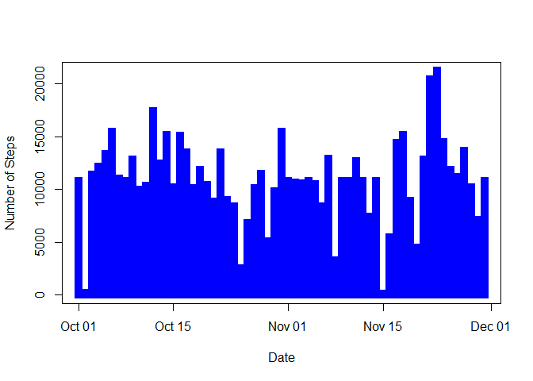
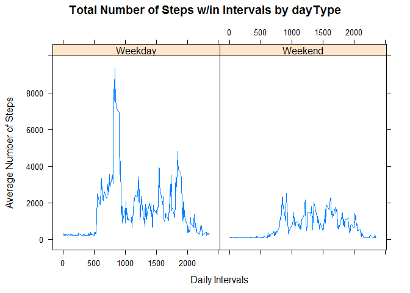

## Loading and Processing Data 

### 1 Unzip data and reading data


```r
activity <- read.csv(unzip("activity.zip", "activity.csv"),header=TRUE, sep=",")
sapply(activity, class)
```

```
##     steps      date  interval 
## "integer"  "factor" "integer"
```

```r
summary(activity)
```

```
##      steps                date          interval     
##  Min.   :  0.00   2012-10-01:  288   Min.   :   0.0  
##  1st Qu.:  0.00   2012-10-02:  288   1st Qu.: 588.8  
##  Median :  0.00   2012-10-03:  288   Median :1177.5  
##  Mean   : 37.38   2012-10-04:  288   Mean   :1177.5  
##  3rd Qu.: 12.00   2012-10-05:  288   3rd Qu.:1766.2  
##  Max.   :806.00   2012-10-06:  288   Max.   :2355.0  
##  NA's   :2304     (Other)   :15840
```

### 2 Process/transform the data (if necessary) into a format suitable for analysis.
activity$date is converted from factor to date class. "zoo" package was used  to manage the time series. Data were collected on 61 days.


```r
activity$date <- as.Date(activity$date, format = "%Y-%m-%d")
suppressWarnings(library(zoo))
```

```
## 
## Attaching package: 'zoo'
```

```
## The following objects are masked from 'package:base':
## 
##     as.Date, as.Date.numeric
```

## Getting mean of Number of Steps Per Day
### 1. Calculating number of steps per day
The result is calculated and stored in the object "steps_day". Missing values are removed. Since the resulting table is large, set {r, results = "hide"}. Approximately the 13% of cases in "steps" result in missing data.


```r
colMeans(is.na(activity))
```

```
##     steps      date  interval 
## 0.1311475 0.0000000 0.0000000
```

```r
steps_day <- aggregate(steps ~ date, rm.na = TRUE, data = activity, FUN = sum)
```

### 2. Histrogram Plot of The Number of Steps Taken per Day 
Missing Values were not omitted


```r
plot(steps_day, type = "h", col = "blue", lend = "square", lwd = 10, xlab = "Date", ylab = "Number of Steps")
```

<!-- -->

### 3. Mean and Median of the Total Number of steps Taken Per Day.


```r
mean(steps_day$steps)
```

```
## [1] 10767.19
```

```r
median(steps_day$steps)
```

```
## [1] 10766
```

## Average Daily Activity Pattern
### 1. Plot

```r
AveStepsbyInterval<-aggregate(steps~interval, activity, mean, na.rm= TRUE)

plot(aggregate(steps ~ interval, data = activity, FUN = mean, na.rm=TRUE), type = "l",col = "blue", xlab = "Interval", ylab = "Average Steps")
```

<!-- -->

### 2. Which 5-minute interval, on average across all the days in the dataset, contains the maximum number of steps?


```r
AveStepsbyInterval[which.max(AveStepsbyInterval[,2]),1]
```

```
## [1] 835
```

## Imputing Missing Values

Note that there are a number of days/intervals where there are missing values (coded as NA). The presence of missing days may introduce bias into some calculations or summaries of the data.

### 1. Calculate and report the total number of missing values in the dataset


```r
missing_days<-sum(is.na(activity$steps))
missing_days
```

```
## [1] 2304
```

### 2. Devise a strategy for filling in all of the missing values in the dataset. The strategy does not need to be sophisticated. For example, you could use the mean/median for that day, or the mean for that 5-minute interval, etc. 

Mean will be used to replace rows with NA values


```r
steps_mean <- mean(AveStepsbyInterval$steps)
```

### 3. Create a new dataset that is equal to the original dataset but with the missing data filled in.


```r
NewActivtityData <-activity
NewActivtityData[is.na(activity$steps),1] <- steps_mean
head(NewActivtityData)
```

```
##     steps       date interval
## 1 37.3826 2012-10-01        0
## 2 37.3826 2012-10-01        5
## 3 37.3826 2012-10-01       10
## 4 37.3826 2012-10-01       15
## 5 37.3826 2012-10-01       20
## 6 37.3826 2012-10-01       25
```

### 4.Make a histogram of the total number of steps taken each day and Calculate and report the mean and median total number of steps taken per day. Do these values differ from the estimates from the first part of the assignment? What is the impact of imputing missing data on the estimates of the total daily number of steps?


```r
NewActivtityData$date <- as.Date(NewActivtityData$date, format = "%Y-%m-%d")
suppressWarnings(library(zoo))
steps_day1 <- aggregate(steps ~ date, rm.na = TRUE, data = NewActivtityData, FUN = sum)
plot(steps_day1, type = "h", col = "blue", lend = "square", lwd = 10, xlab = "Date", ylab = "Number of Steps")
```

<!-- -->

Compare mean and median from original data

```r
NewMean <-mean(steps_day1$steps)
NewMedian <-median(steps_day1$steps)
NewMean
```

```
## [1] 10767.19
```

```r
NewMedian
```

```
## [1] 10767.19
```

There are no significant changes in the values of mean and median from the original data.

## Are there differences in activity patterns between weekdays and weekends?

###1. Converting Dates to Weekends/Weekdays


```r
NewActivtityData$date<-as.Date(NewActivtityData$date)
library(dplyr)
```

```
## Warning: package 'dplyr' was built under R version 3.4.3
```

```
## 
## Attaching package: 'dplyr'
```

```
## The following objects are masked from 'package:stats':
## 
##     filter, lag
```

```
## The following objects are masked from 'package:base':
## 
##     intersect, setdiff, setequal, union
```

```r
NewActivtityData2<-NewActivtityData%>%
        mutate(dayType= ifelse(weekdays(NewActivtityData$date)=="Saturday" | weekdays(NewActivtityData$date)=="Sunday", "Weekend", "Weekday"))
head(NewActivtityData2)
```

```
##     steps       date interval dayType
## 1 37.3826 2012-10-01        0 Weekday
## 2 37.3826 2012-10-01        5 Weekday
## 3 37.3826 2012-10-01       10 Weekday
## 4 37.3826 2012-10-01       15 Weekday
## 5 37.3826 2012-10-01       20 Weekday
## 6 37.3826 2012-10-01       25 Weekday
```

### 2. Make a panel plot containing a time series plot (i.e. type = "l") of the 5-minute interval (x-axis) and the average number of steps taken, averaged across all weekday days or weekend days (y-axis).


```r
AveStepsbyInterval2<-NewActivtityData2 %>%
  group_by(dayType, interval) %>%
  summarize(AveStepByDay=sum(steps))

head(AveStepsbyInterval2)
```

```
## # A tibble: 6 x 3
## # Groups:   dayType [1]
##   dayType interval AveStepByDay
##   <chr>      <int>        <dbl>
## 1 Weekday        0         315.
## 2 Weekday        5         242.
## 3 Weekday       10         231.
## 4 Weekday       15         232.
## 5 Weekday       20         228.
## 6 Weekday       25         283.
```

```r
library(lattice)
with(AveStepsbyInterval2, 
      xyplot(AveStepByDay ~ interval | dayType, 
      type = "l",      
      main = "Total Number of Steps w/in Intervals by dayType",
      xlab = "Daily Intervals",
      ylab = "Average Number of Steps"))
```

<!-- -->
